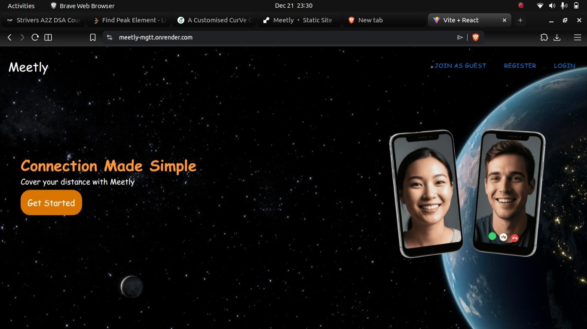
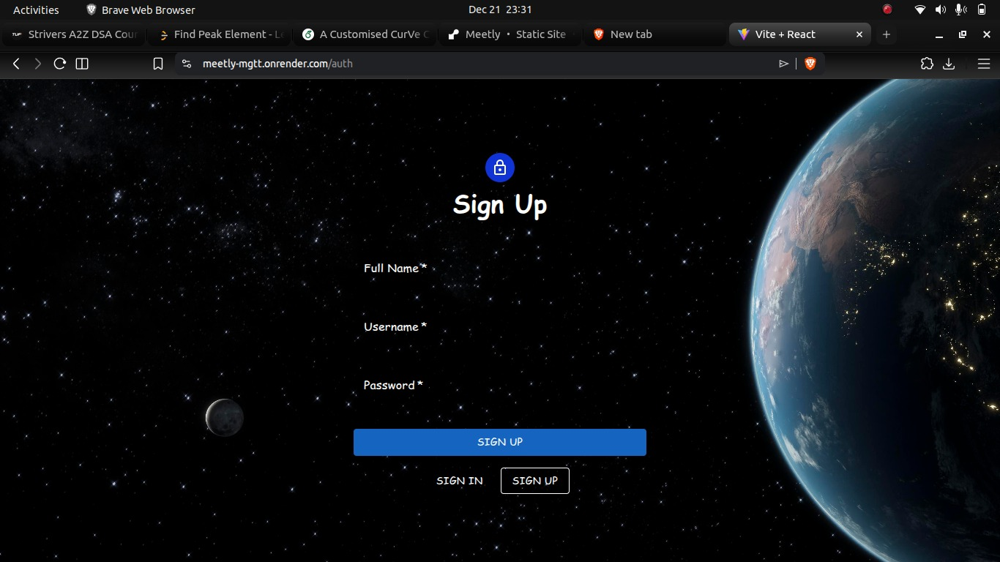

<div align="center">

# 🎥 Meetly

**Secure real-time video conferencing platform**  
Built with WebRTC, Socket.IO & MERN stack

</div>

---

## ✨ About

Meetly is a full-stack real-time video conferencing web application where users can securely authenticate, create or join meeting rooms, and communicate using live video, audio, chat, and screen sharing.

The project focuses on **real-time communication**, **scalable architecture**, and **security-aware backend design**.

---

## 🚀 Features

- 🔐 Secure user authentication  
- 🔑 Join meetings via unique room codes  
- 🎥 Real-time video & audio (WebRTC)  
- 💬 Live chat during meetings  
- 🖥 Screen sharing  
- 👥 Multiple participants per room  

---

## 🔐 Security Overview

- Passwords are **hashed before storage**
- Authentication-protected routes
- Secure Socket.IO signaling
- Media streams handled via **peer-to-peer WebRTC**
- No video or audio data stored on the server
- Environment variables used for sensitive configuration
- CORS configured to restrict unauthorized access

---

## 🛠 Tech Stack

**Frontend**
- React (Vite)
- WebRTC
- Socket.IO Client

**Backend**
- Node.js
- Express.js
- Socket.IO
- MongoDB

**Deployment**
- Render

---

## 📸 Screenshots


<p align="center">
  
  <br/><br/>
  
  <br/><br/>
  
  
  <br/><br/>
  
  <br/><br/>
  
</p>

---

## ⚙️ Run Locally

```bash
# Clone repository
git clone https://github.com/girishthedecent/Meetly.git
cd Meetly

# Backend
cd server
npm install
npm start

# Frontend
cd client
npm install
npm run dev
